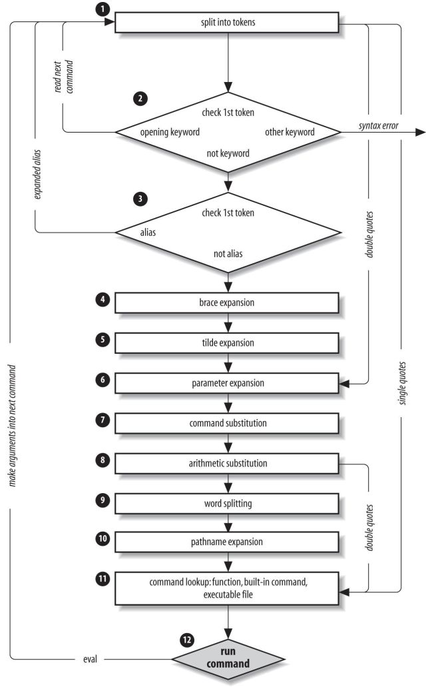

# Command line processing

Description and the diagram from the book:
`Bash Cookbook - Second edition`, Carl Albing, J. P. Vossen, 2018

- command-line processing
- command-line parsing
- bash's parser and lexer mechanism


>What are the exact steps bash follows to process a command line?

The only type of value in the shell is string; when only a single type is available, we might as well say that no types exists, that the shell language is untyped. Thus, whatever the user types on the command line, the shell receives it as an unstructured string - a stream of characters.

1. **Tokenization**

Tokenization is the first stage where bash splits the input using *metacharacters* as delimiters.

Operationally, bash searches the input buffer marking the metacharacters and recording what they do. 
For example, 
For example, besides its usual meaning, the `|` symbol also splits the input into the left and right subcommand.

Note: despite similarities this stage has nothing to do with the word-splitting stage that happens much later.

At this stage, each special character is located and marked in the input buffer.

Command line is split into tokens separated by a fixed set of *metacharacters*:
- `SPACE`, `TAB` (word delimiters)
- `NL`, `;`, `&` (command terminators)
- `(`, `)`       (subshell delimiters)
- `|`, `<`, `>`  (redirection operators)

Types of resulting tokens include
- words
- keywords
- semicolon (sequencing of commands)
- ampersand (runs preceding cmd in bg)
- I/O redirection operators




- alias expansion
- expansions
  - brace expansion
  - tilde expansion
  - parameter expansion
  - variable expansion
- substitution
  - command substitution
  - process substitution
  - arithmetic substitution
- word splitting
- filename generation

## Command-line processing steps

1. Split input into tokens
  - if double quotes: go to step 6
2. Check first token
  - if opening keyword → read next token, go to step 1
  - if other keyword   → emit syntax error, exit code 2
  - if not keyword     → 
3. Check first token
  - if alias           → expand it, go to step 1
  - if not alias       → 
4. Brace expansion
5. Tilde expansion
6. Parameter expansion
7. Command substitution
8. Arithmetic Substitution
9. Word splitting
10. Pathname expansion
11. Command lookup: function > builtin > external executables
12. Execute the command
  - after execution, the precedure goes back to step 1 to process the other commands (in a compound pipeline)
  - or it goes back to step 1 to process the args of the first command.


## Description

For each pipeline that it reads, the shell breaks it up into commands, sets up the I/O for the pipeline, then does the following for each command:

1. Splits the command into tokens 
   separated by the fixed set of metacharacters:
   `SPACE`, `TAB`, `NEWLINE`, `;`, `(`, `)`, `<`, `>`, `|`, `&`
   Types of tokens include words, keywords, I/O redirectors, semicolons.

2. Checks the first token of each command 
   to see if it is a keyword with no quotes or backslashes. 
   If it is
    - an *opening keyword* (like `if`, `for`)
    - a control-structure opener
    - function
    - `{`
    - `(`
   then the command is actually a compound command.

The shell sets things up internally for the compound command, reads the next
command, and starts the process again. If the keyword isn't a compound com‐
mand opener (e.g., it is a control-structure "middle" like then, else, or do; an
"end" like fi or done; or a logical operator), the shell signals a syntax error.

3. Checks the first word of each command against the list of aliases. If a match is
found, it substitutes the alias's definition and goes back to step 1; otherwise, it
goes on to step 4. This scheme allows recursive aliases and allows for keywords to
be defined (e.g., alias aslongas=while or alias procedure=function).
4. Performs brace expansion. For example, a{b,c} becomes ab ac .
5. Substitutes the user's home directory ($HOME) for tilde if it is at the beginning of a
word. Substitutes the user's home directory for ~user.
6. Performs parameter (variable) substitution for any expression that starts with a
dollar sign ($).
7. Does command substitution for any expression of the form $(string).
8. Evaluates arithmetic expressions of the form $((string)).
9. Takes the parts of the line that resulted from parameter, command, and arith‐
metic substitution and splits them into words again. This time it uses the charac‐
ters in $IFS as delimiters instead of the set of metacharacters in step 1.
10. Performs pathname expansion, a.k.a. wildcard expansion, for any occurrences of
*, ?, and [] pairs.
11. Uses the first word as a command by looking up its source in the following order:
as a function command, then as a builtin, then as a file in any of the directories in
$PATH .
12. Runs the command after setting up I/O redirection and other such things.


## Notes

- command precedence is basically: alias, keyword, function, builtin, file
- if double quotes are encountered as the first token, jumps to step 6, skipping the brace expansion and tilde expansion (since these are escaped by double quotes).
- single quote make the procedure skip all the way to step 11
- double quotes occurring after arithmetic substitution make the procedure jump to step 11
- bash keyword can only occur as the first word of a simple command; i.e. as the first word of each part of a pipeline (compound command). if keywords are involved the result is certainly a compound command type (list, expression, conditional).


```bash
type in # ›in is a shell keyword
echo in # ›in
in=sider
echo in # ›sider
```
