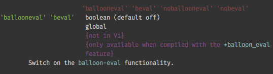

# Vim help

https://vi.stackexchange.com/questions/2136/how-do-i-navigate-to-topics-in-vims-documentation

Vim comes with an exhaustive and fully indexed documentation.

`:help` command is the gateway to documentation.
`:help help` Let's go meta

You can complete the arguments with <Tab> and display the list of possible completions with <C-d>.

    :help buf<Tab>
    :help :w<C-d>

By the way, here is an explanation of key notation:

    :help key-notation

Most Ex commands can be shortened to a few characters. 
That's true for :help too: `:h`

:help command and its tab-completion are *case-insensitive* so the two commands below will get you to the same section:

    :h BufWritePost
    :h bufwritepost

Note that `a` and `A` are both legitimate commands so case-insensitivity doesn't apply.

If you only have a generic keyword to search for, use `:helpgrep` and open the quickfix window:

    :helpgrep quickfix
    :copen


- `<C-]>` on the highlighted words to jump to the corresponding tag
- `<C-t>` come back

See `:help tags` for more.


Use the right syntax to search more efficiently:

```vim
:h :command   " help for ex-command 'command'
:h 'option'   " help for option 'option'
:h function() " help for function 'function'

" help for 'modifier'-'key' in normal mode
:h modifier-key

" help for 'modifier'-'key' in 'mode'
:h mode_modifier-key

" help for 'modifier'-'key' 'modifier'-'key' in 'mode'
:h mode_modifier-key_modifier-key
```

Examples:

```vim
:h :sort
:h 'ai                " only one quote needed
:h bufnr(             " no need to close parenthesis
:h v_ctrl-g           " in visual mode
:h i_ctrl-x_ctrl-o    " in insert mode
:h ctrl-w             " no mode signifier required for normal mode
```


Anatomy of a :help section:

    :help ballooneval'



- words in red are tags associated with the option
- words in green are the long and short form of the option name
- first line in white says that it's a boolean option and that it's off by default, see `:help options`
- second line in white says that the option is global, see `:help option-summary`
- purple lines are self-explanatory
- then comes the description of the option
- all words in turquoise are "tags" that let you jump to another part of the documentation.

* Once you have found the handy `:help list-functions` you know where to look for string-related functions
* Once you have found `:help i_ctrl-x_ctrl-o` you know where to look for help on <C-x><C-l> in insert mode?
