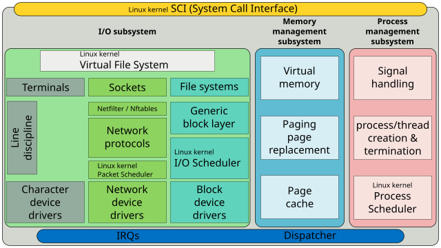

# Linux :: Kernel

- Linux kernel SCI (System call inteface)
- I/O Subsystem
  - Linux kernel VFS
    - Terminals
      - Line discipline
      - Character device drivers
    - Sockets
      - Netfilter/Nftables
      - Network protocols
      - Network device drivers
      - Linux kernel Packet Scheduler
    - FSs
      - Generic block layer
      - Linux kernel IO Scheduler
      - Block device drivers
- Memory Management Subsystem
  - VM
  - Paging page replacement
  - Page cache
- Process Management Subsystem
  - Signal handling
  - process/thread creation and termination
  - Linux kernel Process Scheduler
- IRQ
- Dispatcher
