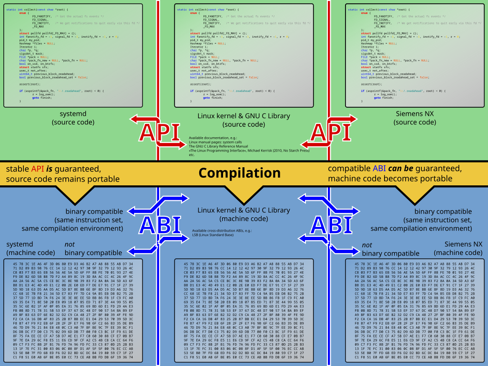

# Linux

* The Linux Kernel documentation
https://www.kernel.org/doc/html/v5.0/index.html

* Interactive map of Linux kernel
https://makelinux.github.io/kernel/map/

* Specs and standards
  - POSIX standard
  - File System Hierarchy
  - SUS Single Unix Spec

* Linux kernel
  - Linux system calls
  - Linux interrupts
  - Linux terminal
  - Linux shell
  - Linux text mode
  - Linux userspace
    - FUSE
- Linux admin
  - Linux scripting
  - Linux daemons
    - firewall: ip-tables, ufw
    - selinux
    - llvm? virtual disks, raid
  - Linux tooling
    - grub

Linux kernel interfaces: the GNU C Library is a wrapper around the system calls of the Linux kernel.

