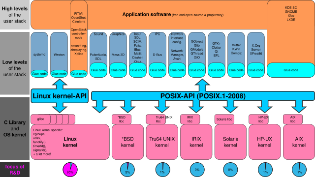
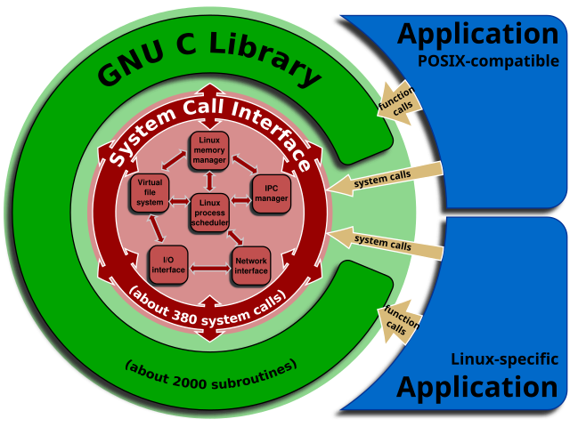

# Linux kernel interfaces

https://en.wikipedia.org/wiki/Linux_kernel_interfaces

The Linux kernel provides multiple interfaces to user-space and kernel-mode code that are used for varying purposes and that have varying properties by design.

There are 2 types of API in the Linux kernel:
- kernel-userspace API
- kernel internal API

## Linux API

>The Linux API includes the kernel-userspace API, which allows code in user space to access system resources and services of the Linux kernel.

It is composed of
- the system call interface of the Linux kernel
- the subroutines in the C standard library

The focus of the development of the Linux API has been to provide the usable features of the specifications defined in POSIX in a way which is reasonably compatible, robust and performant, and to provide additional useful features not defined in POSIX, just as the kernel-userspace APIs of other systems implementing the POSIX API also provide additional features not defined in POSIX.

The *Linux API*, by choice, has been kept stable over the decades through a policy of not introducing breaking changes; this stability guarantees the portability of source code. At the same time, Linux kernel developers have historically been conservative and meticulous about introducing new system calls.

Much available free and open-source software is written for the *POSIX API*. Since so much more development flows into the Linux kernel as compared to the other POSIX-compliant combinations of kernel and C standard library, the Linux kernel and its API have been augmented with additional features.

Programming for the full Linux API, rather than just the POSIX API, may provide advantages in cases where those additional features are useful. Well-known current examples are *udev*, *systemd* and *Weston*. People such as Lennart Poettering openly advocate to prefer the Linux API over the POSIX API, where this offers advantages.

At FOSDEM 2016, Michael Kerrisk explained some of the perceived issues with the Linux kernel's user-space API, describing that it contains multiple design errors by being non-extensible, unmaintainable, overly complex, of limited purpose, in violation of standards, and inconsistent. Most of those mistakes cannot be fixed because doing so would break the ABI that the kernel presents to the user space.

## System call interface of the Linux kernel

>The system call interface of a kernel is the set of all implemented and available system calls in a kernel.

In the Linux kernel, various subsystems, such as the Direct Rendering Manager (DRM), define their own system calls, all of which are part of the system call interface.

Various issues with the organization of the Linux kernel system calls are being publicly discussed. Issues have been pointed out by Andy Lutomirski, Michael Kerrisk and others.

## The C standard library

A C standard library for Linux includes wrappers around the system calls of the Linux kernel; the combination of the Linux kernel system call interface and a C standard library is what builds the Linux API.

Some popular implementations of the C standard library are
- glibc
- uClibc
- klibc
- Newlib
- musl
- dietlibc
- libbionic and libhybris

## Additions to POSIX

As in other Unix-like systems, additional capabilities of the Linux kernel exist that are not part of POSIX:
- *cgroups subsystem*, the system calls it introduces and *libcgroup*
- The system calls of the Direct Rendering Manager, especially the driver-private `ioctls` for the command submission, are not part of POSIX.
- Advanced Linux Sound Architecture (ALSA) could set system calls, which are not part of POSIX
- The system calls `futex` (fast userspace mutex), `epoll`, `splice`, `dnotify`, `fanotify`, and `inotify` are exclusive to the Linux kernel
- system call `getrandom` was introduced in 3.17 of Linux kernel mainline
- `memfd` was proposed by the kdbus developers
- `memfd_create` was merged into Linux kernel mainline in kernel version 3.17
- `readahead` initiates a file "read-ahead" into page cache

DRM has been paramount for the development and implementations of well-defined and performant free and open-source graphics device drivers without which no rendering acceleration would be available at all, only the 2D drivers would be available in the X.Org Server. DRM was developed for Linux, and since has been ported to other operating systems as well.
