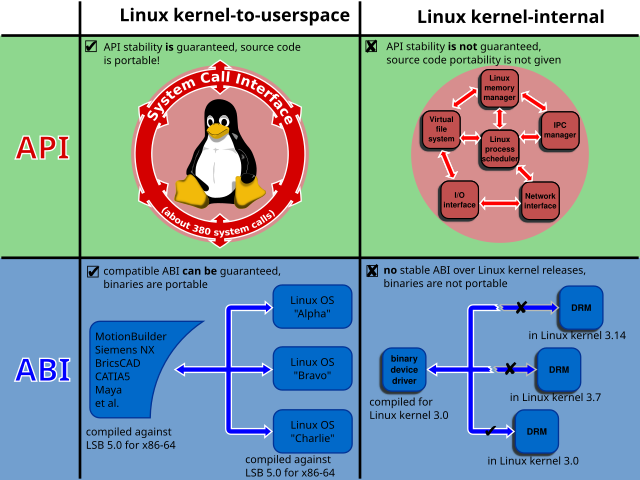

# System call

https://en.wikipedia.org/wiki/System_call

A system call (syscall) is the programmatic way in which a program requests services from the OS. System calls provide an essential interface between a process and the OS.

This may include hardware-related services (e.g. accessing a hard disk), creation and execution of new processes, and communication with integral kernel services such as process scheduling.

In most systems, system calls can only be made from *userspace processes*, while in some systems (OS/360) privileged system code also issues system calls.

For embedded systems, system calls typically do not change the privilege mode of the CPU.

Linux kernel has approx 300 system calls.

## Privileges

The architecture of most modern processors, with the exception of some embedded systems, involves a *security model*.

For example, the *rings model* specifies multiple privilege levels under which software may be executed: a program is usually limited to its own address space so that it cannot access or modify other running programs or the OS itself, and is usually prevented from directly manipulating hardware devices (e.g. the frame buffer or network devices).

However, many applications need access to these components, so system calls are made available by the OS to provide well-defined, safe implementations for such operations.

The OS executes at the highest level of privilege, and allows applications to request services via system calls, which are often initiated via interrupts. An *interrupt* automatically puts the CPU into some elevated privilege level and then passes control to the kernel, which determines whether the calling program should be granted the requested service. If the service is granted, the kernel executes a specific set of instructions over which the calling program has no direct control, returns the privilege level to that of the calling program, and then returns control to the calling program.

## The library as an intermediary

Generally, systems provide a library or API that sits between normal programs and the operating system. On Unix-like systems, that API is usually part of an implementation of the C library (libc), such as glibc, that provides wrapper functions for the system calls, often named the same as the system calls they invoke.

The call to the library function itself does not cause a switch to kernel mode and is usually a normal subroutine call, using, for example, a `CALL` assembly instruction in some instruction set architectures. The actual system call does transfer control to the kernel, and is more implementation-dependent and platform-dependent than the library call abstracting it.

For example, in Unix-like systems, `fork` and `execve` are C library functions that in turn execute instructions that invoke the `fork` and `exec` system calls.

Making the system call directly in the application code is more complicated and may require embedded assembly code to be used (in C and C++), as well as requiring knowledge of the low-level binary interface for the system call operation, which may be subject to change over time and thus not be part of the application binary interface (ABI); the library functions are meant to abstract this.

## Examples and tools

On POSIX-compliant OS, popular system calls are
- open
- read
- write
- close
- wait
- exec
- fork
- exit
- kill

Many OSs have hundreds of system calls:
- Plan9      51
- Linux     300
- OpenBSD   300
- NetBSD    500
- FreeBSD   500
- Windows  2000

Tools such as `strace`, `ftrace` and `truss` allow a process to execute from start and report all system calls the process invokes, or can attach to an already running process and intercept any system call made by the said process if the operation does not violate the permissions of the user. This special ability of the program is usually also implemented with system calls such as `ptrace` or system calls on files in `procfs`.

## Typical implementations

>Implementing system calls requires a transfer of control from user space to kernel space, which involves some sort of architecture-specific feature.

A typical way to implement this is to use a software interrupt or trap.

*Interrupts* transfer control to the kernel, so software simply needs to set up some register with the system call number needed, and execute the software interrupt.

This is the only technique provided for many RISC processors, but CISC architectures such as x86 support additional techniques. For example, the x86 instruction set contains the instructions SYSCALL/SYSRET (preferred for 32-bit processes) and SYSENTER/SYSEXIT (preferred for 64-bit processes); these two mechanisms were independently created by AMD and Intel, respectively. These are "fast" control transfer instructions that are designed to quickly transfer control to the kernel for a system call without the overhead of an interrupt.

Linux 2.5 began using this on the x86, where available; formerly it used the INT instruction, where the system call number was placed in the EAX register before interrupt 0x80 was executed.

## Categories of system calls

System calls can be grouped roughly into 6 major categories:
1. Process control
  - create process (fork)
  - terminate process
  - load
  - execute
  - get/set process attributes
  - wait for time
  - wait event
  - signal event
  - allocate memory
  - free memory
2. File management
  - create file
  - delete file
  - open file
  - close file
  - read file
  - write file
  - seek (reposition file pointer)
  - get/set file attributes
3. Device management
  - request device
  - release device
  - read, write, reposition
  - get/set device attributes
  - logically attach or detach devices
4. Information maintenance
  - get/set total system information (incl time, date, computer name)
  - get/set process, file, device metadata (incl author, opener, ctime)
5. Communication
  - create, delete communication connection
  - send, receive messages
  - transfer status information
  - attach or detach remote devices
6. Protection
  - get/set file permissions

## Processor mode and context switching

System calls in most Unix-like systems are processed in kernel mode, which is accomplished by changing the processor execution mode to a more privileged one, but no process context switch is necessary - although a privilege context switch does occur.

The hardware sees the world in terms of the execution mode according to the processor status register, and processes are an abstraction provided by the OS.

A system call does not generally require a context switch to another process; instead, it is processed in the context of whichever process invoked it.

In a multithreaded process, system calls can be made from multiple threads. The handling of such calls is dependent on the design of the specific OS kernel and the application runtime environment.

The following list shows typical models followed by OSs:

- *Many-to-one model*:   
All system calls from any user thread in a process are handled by a single kernel-level thread. This model has a serious drawback - any blocking system call (like awaiting input from the user) can freeze all the other threads. Also, since only one thread can access the kernel at a time, this model cannot utilize multiple cores of processors.

- *One-to-one model*:   
Every user thread gets attached to a distinct kernel-level thread during a system call. This model solves the above problem of blocking system calls. It is found in all major Linux distributions, macOS, iOS, recent Windows and Solaris versions.

- *Many-to-many model*:   
In this model, a pool of user threads is mapped to a pool of kernel threads. All system calls from a user thread pool are handled by the threads in their corresponding kernel thread pool.

- *Hybrid model*:    
This model implements both many to many and one to one models depending upon the choice made by the kernel. This is found in old versions of IRIX, HP-UX and Solaris.
