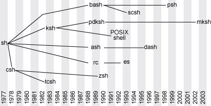
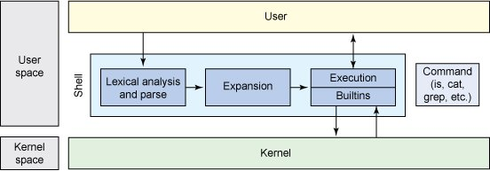

# Evolution of shells in Linux

* Evolution of shells in Linux: From Bourne to Bash and beyond
by M. Jones, Dec 8th 2011
https://developer.ibm.com/tutorials/l-linux-shells/

Shells are like editors - everyone has a favorite and vehemently defends that choice (and tells you why you should switch). True, shells can offer different capabilities but they are all based on the same core ideas developed decades ago.

My first experience with a modern shell came in the 1980s, when I was developing software on SunOS. Once I learned the capability to *send the output from one program as input to another* (even to do this multiple times in a chain), I had a simple and efficient way to create filters and transformations. This core idea provided a way to build simple tools that were flexible enough to be *composed* with other tools in useful combinations. In this way, shells provided not only a way to interact with the kernel and devices, but they also offered integrated services (such as *pipes* and *filters*), which have now became common design patterns in software development.

Let's begin with a short history of modern shells, and then explore some of the useful and exotic shells available for Linux today.

## A history of shells

Shells, or *command-line interpreters*, have a long history, but this discussion begins with the first UNIX shell.

Ken Thompson (of Bell Labs) developed the first shell for UNIX called the **V6 shell**, aka the **Thompson shell**, in 1971.

Similar to its predecessor in Multics, this shell (`/bin/sh`) was an independent user program that executed outside the kernel.

Concepts like *globbing* (pattern matching for parameter expansion, such as `*.txt`) were implemented in a separate utility called `/etc/glob`, as was the `if` command that evaluated conditionals. This separation kept the shell codebase small, at under 900 lines of C source.

The shell introduced a compact syntax for *redirection* (`<`, `>`, `>>`) and *piping* (`|` or `^`) that has survived into the modern shells; as did the syntax for sequencing commands (`;`) and asynchronous execution (`&`).

What the Thompson shell lacked was the scripting ability. Its sole purpose was to be an *interactive shell* (aka command interpreter) that one would use to invoke commands and view their results.

## Shells as little languages

Shells are specialized, domain-specific languages ("little languages") that implement a specific use model - in this case, providing an interface to an operating system.

In addition to being text-orientated, there are graphical user interface shells, as well as REPLs (e.g. Python shell or Ruby's irb).

The shell idea has also been applied to Web searching through a frontend called `goosh`. This shell over Google permits command-line searching through Google using commands such as search, more, and go.

## UNIX shells since 1977

Beyond the Thompson shell, 1977 saw the introduction of the Bourne shell.

The **Bourne shell**, created by Stephen Bourne at AT&T Bell Labs for V7 UNIX, remains a useful shell today (even the default shell on some systems).

The author developed the Bourne shell after working on an ALGOL68 compiler, so you'll find its grammar more similar to the Algorithmic Language (ALGOL) than other shells. The source code itself, although developed in C, even made use of *macros* to give it an ALGOL68 flavor.

The Bourne shell had two primary goals: to serve as a command interpreter to interactively execute commands, and to be used for scripting.

In addition to replacing the Thompson shell, the Bourne shell offered several advantages over its predecessors.

Bourne introduced control flow, loops, variables, providing a more functional language (used both, interactively and non-interactively).

The shell also permitted you to use shell scripts as *filters*, providing integrated support for *signal handling*, but it lacked the ability to define *user functions*.

It also incorporated a number of features we take for granted today, including *command substitution* (with backticks), and *here-doc* syntax that preserved embedded string literals.

The Bourne shell was not only an important step forward but also the template for numerous derivative shells, many of which are still in use today.

The figure approxiametes the primary lineage of shells:



The Bourne shell has led to the development and influenced the Korn shell (ksh), Almquist shell (ash), Bourne Again Shell (bash). The C shell (csh) was still under development at the time the Bourne shell was released.

## Basic shell architecture

The fundamental architecture of a hypothetical shell is simple (as evidenced by Bourne's shell). As you can see in Figure 2 below, the basic architecture looks similar to a pipeline, where input is analyzed and parsed, symbols are expanded (using a variety of methods such as brace, tilde, variable and parameter expansion and substitution, and file name generation), and finally commands are executed (using shell built-in commands, or external commands).


Architecture of a simple hypothetical shell

## Exploring Linux shells

Let's now explore a few of these shells to review their contribution and examine an example script in each. This review includes the C shell, the Korn shell, and Bash.

### The Tenex C shell

The C shell was developed for Berkeley Software Distribution (BSD) UNIX systems by *Bill Joy* while he was a graduate student at the University of California, Berkeley, in 1978.

Five years later, the shell introduced functionality from the Tenex system (popular on DEC PDP systems). Tenex introduced *file name and command completion* in addition to *command-line editing features*. 

The Tenex C shell (tcsh) remains backward-compatible with `csh` but improved its overall interactive features. The tcsh was developed by Ken Greer at Carnegie Mellon University.

One of the key design objectives for the C shell was to create a *scripting language* that looked similar to the C language. This was a useful goal, given that C was the primary language in use (in addition to the operating system being developed predominantly in C).

A useful feature introduced by Bill Joy in the C shell was *command history*. This feature maintained a history of the previously executed commands and allowed the user to review and easily select previous commands to execute. For example, typing the command history would show the previously executed commands. The up and down arrow keys could be used to select a command, or the previous command could be executed using `!!`. It's also possible to refer to arguments of the prior command; for example, `!*` refers to all arguments of the prior command, where `!$` refers to the last argument of the prior command.

Take a look at a short example of a tcsh script below. This script takes a single argument (a directory name) and emits all executable files in that directory along with the number of files found. This script is reused in each example to illustrate differences.

The tcsh script is divided into 3 basic sections. First, note that I use the shebang, or hashbang symbol, to declare this file as interpretable by the defined shell executable (in this case, the tcsh binary). This allows me to execute the file as a regular executable rather than precede it with the interpreter binary. It maintains a count of the executable files found, so I initialize this count with zero.

```sh csh
#!/bin/tcsh

# find all executables

set count=0

# Test arguments
if ($#argv != 1) then
  echo "Usage is $0 <dir>"
  exit 1
endif

# Ensure argument is a directory
if (! ‑d $1) then
  echo "$1 is not a directory."
  exit 1
endif

# Iterate the directory, emit executable files
foreach filename ($1/*)
  if (‑x $filename) then
    echo $filename
    @ count = $count + 1
  endif
end

echo
echo "$count executable files found."

exit 0
```

The first section tests the arguments passed by the user. The `#argv` variable represents the number of arguments passed in (excluding the command name itself). You can access these arguments by specifying their index: For example, `#1` refers to the first argument (which is shorthand for `argv[1]`). The script is expecting one argument; if it doesn't find it, it emits an error message, using `$0` to indicate the command name that was typed at the console (`argv[0]`).

The second section ensures that the argument passed in was a directory. The `-d` operator returns `True` if the argument is a directory. But note that I specify a `!` symbol first, which means negate. This way, the expression says that if the argument is not a directory, emit an error message.

The final section iterates the files in the directory to test whether they're executable. I use the convenient `foreach` iterator, which loops through each entry in the parentheses (in this case, the directory), and then tests each as part of the loop. This step uses the `-x` operator to test whether the file is an executable; if it is, the file is emitted and the count increased. I end the script by emitting the count of executables.

## Korn shell

The Korn shell (ksh), designed by David Korn, was introduced around the same time as the Tenex C shell. One of the most interesting features of the Korn shell was its use as a scripting language in addition to being backward-compatible with the original Bourne shell.

The Korn shell was proprietary software until the year 2000, when it was released as open source (under the Common Public License). In addition to providing strong backward-compatibility with the Bourne shell, the Korn shell includes features from other shells (such as history from csh). 

The shell also provides several more advanced features found in modern scripting languages like Ruby and Python-for example, *associative arrays* and *floating point arithmetic*. 

The Korn shell is available in a number of operating systems, including IBM AIX and HP-UX, and strives to support the POSIX shell language standard.

The Korn shell is a derivative of the Bourne shell and looks more similar to it and Bash than to the C shell. Let's look at an example of the Korn shell for finding executables.

```sh ksh
#!/usr/bin/ksh

# find all executables

count=0

# Test arguments
if [ $# ‑ne 1 ] ; then
  echo "Usage is $0 <dir>"
  exit 1
fi

# Ensure argument is a directory
if [ ! ‑d  "$1" ] ; then
  echo "$1 is not a directory."
  exit 1
fi

# Iterate the directory, emit executable files
for filename in "$1"/*
do
  if [ ‑x "$filename" ] ; then
    echo $filename
    count=$((count+1))
  fi
done

echo
echo "$count executable files found."

exit 0
```

The first thing you'll notice is its similarity to csh. Structurally, the script is almost identical, but key differences are evident in the way conditionals, expressions, and iteration are performed. Instead of adopting C-like test operators, ksh adopts the typical Bourne-style operators (-eq, -ne, -lt, and so on).

The Korn shell also has some differences related to iteration. In the Korn shell, the `for…in` structure is used, with command substitution to represent the list of files created from standard output for the command `ls "$1"/*` representing the contents of the named subdirectory.

In addition to the other features defined above, Korn supports the *alias feature* (to replace a word with a user-defined string). 

Korn has many other features that are disabled by default (such as *file name completion*) but can be enabled by the user.

### Bash

The Bourne-Again Shell, or Bash, is an open source GNU project intended to replace the Bourne shell. Bash was developed by Brian Fox and has become one of the most ubiquitous shells available (appearing in Linux, Darwin, Windows, Cygwin, Novell, Haiku, and more). As its name implies, Bash is a superset of the Bourne shell, and most Bourne scripts can be executed unchanged.

In addition to supporting backward-compatibility for scripting, Bash has incorporated features from the Korn and C shells. You'll find command history, command-line editing, a directory stack (pushd and popd), many useful environment variables, command completion, and more.

Bash has continued to evolve, with new features, support for regular expressions (similar to Perl), and associative arrays. Although some of these features may not be present in other scripting languages, it's possible to write scripts that are compatible with other languages. To this point, the sample script shown in Listing 3 is identical to the Korn shell script (from Listing 2) except for the shebang difference (/bin/bash).

---

One key difference among these shells is the licenses under which they are released. Bash, as you would expect, having been developed by the GNU project, is released under the GPL, but csh, tcsh, zsh, ash, and scsh are all released under the BSD or a BSD-like license. The Korn shell is available under the Common Public License.

## Exotic shells

For the adventurous, alternative shells can be used based on your needs or taste. The *Scheme shell (scsh)* offers a scripting environment using Scheme (a derivative of the Lisp language). The *Pyshell* is an attempt to create a similar script that uses the Python language. Finally, for embedded systems, there's *BusyBox*, which incorporates a shell and all commands into a single binary to simplify its distribution and management.

Listing 4 provides a look at the find-all-executables script within the Scheme shell (scsh). This script may appear foreign, but it implements similar functionality to the scripts provided thus far. This script includes three functions and directly executable code (at the end) to test the argument count. The real meat of the script is within the `showfiles` function, which iterates a list (constructed after `with-cwd`), calling `write-ln` after each element of the list. This list is generated by iterating the named directory and filtering it for files that are executable.

```sh scsh
#!/usr/bin/scsh ‑s
!#

(define argc
        (length command‑line‑arguments))

(define (write‑ln x)
        (display x) 
)

(define (showfiles dir)
        (for‑each write‑ln
                (with‑cwd dir
                        (filter file‑executable? (directory‑files "." #t)))))

(if (not (= argc 1))
        (write‑ln "Usage is fae.scsh dir")
        (showfiles (argv 1)))
```


## Conclusion

Many of the ideas and much of the interface of the early shells remain the same almost 35 years later-a tremendous testament to the original authors of the early shells. In an industry that continually reinvents itself, the shell has been improved upon but not substantially changed. Although there have been attempts to create specialized shells, the Bourne shell derivatives continue to be the primary shells in use.
