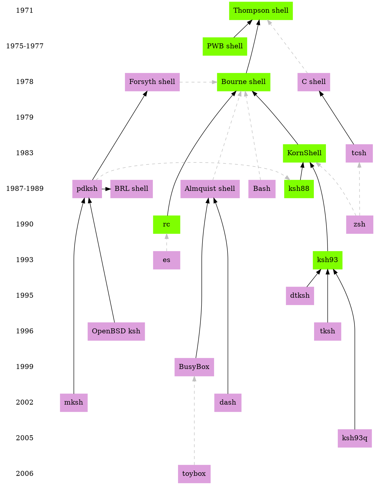

# Shell ancestry

https://github.com/marcpaq/shellancestry

A history (ahem) of command shells in Unix and Unix-like systems.

Each shell appears at the year that it was first announced to the
world. For example, S. R. Bourne describes his shell in the *Bell
System Technical Journal* in 1978 but Bell released it to the world in
1979 or so.

A shell uses a solid, black arrow to point to a shell that it
borrows source code from. A shell uses a dashed, grey arrow to point
to a shell that the former attempts to be compatible with while not 
using the latter's source code.

A plum-coloured shell has an open, free, or public license. 

A green shell had a proprietary or closed license at the time that it was
announced. Source for many formerly-closed shells are now available for us
to look at. For example, Bell Labs released to source code to UNIX,
available in a few links below.

The authors of a shell are the people credited at the time of the shell's 
announcement. 

## Almquist shell

Author: Kenneth Almquist

Also known as ash.

https://en.wikipedia.org/wiki/Almquist_shell

## Bash

Author: Brian Fox

https://en.wikipedia.org/wiki/Bash_(Unix_shell)

## Bourne shell

Author: S. R. Bourne

https://en.wikipedia.org/wiki/Bourne_shell

https://archive.org/details/bstj57-6-1971

## BRL shell

Authors: Doug A Gwyn, Doug Kingston, Ron Natalie, Arnold Robbins, Lou Salkind, and others?

https://web.archive.org/web/20040227010520/http://web.cs.mun.ca:80/~michael/pdksh/CONTRIBUTORS

## BusyBox

Author: Bruce Perens

https://en.wikipedia.org/wiki/BusyBox

https://www.busybox.net/

## C shell

Author: Bill Joy

https://en.wikipedia.org/wiki/C_shell

## Desktop KornShell

Author: Stephen J. Pendergrast

Also known as dtksh

https://books.google.ca/books?id=O6xQAAAAMAAJ&q=Desktop+Korn+Shell+Graphical+Programming+For+the+Common+Desktop+Environment+Version+1.0&dq=Desktop+Korn+Shell+Graphical+Programming+For+the+Common+Desktop+Environment+Version+1.0&hl=en&sa=X&ved=0ahUKEwjjg9Tp0MXeAhXK34MKHeoZB74Q6AEIKTAA

## Forsyth shell

Author: Charles Forsyth

I've corresponded with Charles Forsyth. He tells me that he adapted his shell for MINIX 1 too.

http://www.terzarima.net/

https://web.archive.org/web/20040227010520/http://web.cs.mun.ca:80/~michael/pdksh/CONTRIBUTORS

## es shell

Authors: Paul Haahr, Byron Rakitzis

ftp://ftp.sys.toronto.edu/pub/es/old/

http://citeseerx.ist.psu.edu/viewdoc/summary?doi=10.1.1.45.8024

https://stuff.mit.edu/afs/sipb/user/yandros/doc/es-usenix-winter93.html

## Korn shell, ksh88, ksh93, ksh93q

Author: David G. Korn

https://en.wikipedia.org/wiki/KornShell

http://www.kornshell.com/info/

http://man.openbsd.org/ksh

## mksh

Author: ?

https://en.wikipedia.org/wiki/MirOS_BSD

## Public Domain Korn shell, OpenBSD ksh

Author: Eric Gisin

https://web.archive.org/web/20040227010520/http://web.cs.mun.ca:80/~michael/pdksh/CONTRIBUTORS

## PWB shell

Author: John Mashey

Programmer's Work Bench shell, aka Mashey shell

https://en.wikipedia.org/wiki/PWB_shell

https://grosskurth.ca/bib/1976/mashey-command.pdf

https://groups.google.com/forum/#!original/net.unix-wizards/k1FW4s0X7jw/4GNAGTPHLXQJ

## rc shell

Author: Tom Duff

https://en.wikipedia.org/wiki/Plan_9_from_Bell_Labs

https://en.wikipedia.org/wiki/Rc

http://doc.cat-v.org/plan_9/4th_edition/papers/rc

http://citeseerx.ist.psu.edu/viewdoc/versions?doi=10.1.1.47.1625

## Thompson shell

Author: Ken Thompson

https://en.wikipedia.org/wiki/Thompson_shell

https://www.bell-labs.com/usr/dmr/www/hist.html

## tcsh

Authors: Ken Greer, Paul Placeway, Christos Zoulas, et al.

https://en.wikipedia.org/wiki/Tcsh

https://github.com/tcsh-org/tcsh

https://groups.google.com/forum/?hl=en#!msg/net.sources/BC0V7oosT8k/MKNdzEG_c3AJ

## tksh

https://www.usenix.org/legacy/publications/library/proceedings/tcl96/full_papers/korn/index.html

## toybox

Author: Robert Landley

https://en.wikipedia.org/wiki/toybox

http://www.landley.net/toybox

## zsh
Author: Paul Falstad
https://groups.google.com/forum/#!msg/alt.sources/tVgN49u8Ax4/7VgQlHZ4bJMJ
http://zsh.sourceforge.net/FAQ/zshfaq01.html#l1

## Thanks

https://www.in-ulm.de/~mascheck/various/
http://www.graphviz.org/Documentation/TSE93.pdf
