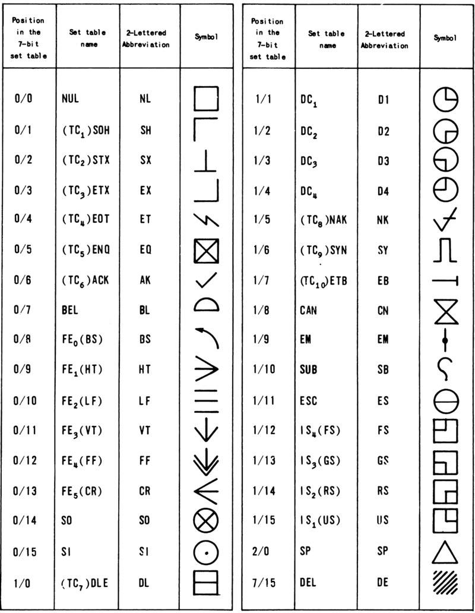

# ASCII Control Characters

US-ASCII (1967) Control Character Symbols Chart

## Control Characters

NUL: The all zeros character. 

SOH (Start of Heading): A communication control character used at the beginning of a sequence of characters which constitutes a machine - sensible address of routing information. Such a sequence is referred to as the "heading". An STX character has the effect of terminating a heading.

STX (Start of Text): A communication control character which precedes a sequence of characters that is to be treated as an entity and entirely transmitted through to the ultimate destination. Such a sequence is referred to as "text". STX may be used to terminate a sequence of characters started by SOH.

ETX (End of Text): A communication control character used to terminate a sequence of characters started with STX and transmitted as an entity.

EOT (End of Transmission): A communication control character, used to indicate the conclusion of a transmission which may have contained one or more texts and any associated headings.

ENQ (Enquiry): A communication control character used in data communication systems as a request for a response from a remote station. It may be used as a "Who Are You" (WRU) to obtain identification, or may be used to obtain station status, or both.

ACK (Acknowledge): A communication control character transmitted by a receiver as an affirmative response to a sender.

BEL: A character for use when there is a need to call for human attention. It may control alarm or attention devices.

BS (Backspace): A format effector which controls the movement of the rinting position one printing space backward on the same printing line (applicable to display devices).

HT (Horizontal Tabulation): A format effector which controls the movement of the printing position to the next in a series of predetermined positions along the printing line. (Applicable als to display devices and the skip function on punched cards).

LF (Line Feed): A format effector which controls the movement of the printing position to the next printing line (applicable also to display devices). Where appropriate, this character may have the meaning "New Line" (NL), a format effector which controls the movement of the printing point to the first printing position on the next printing line. Use of this convention requires agreement between sender and recipient of data.

VT (Vertical Tabulation): A format effector which controls the movement of the printing position to the next in a series of predetermined printing lines (applicable also to display devices).

FF (Form Feed): A format effector which controls the movement of the printing position to the first predetermined printing line on the next form or page (applicable also to display devices).

CR (Carriage Return): A format effector which controls the movement of the printing position to the first printing position on the same printing line (applicable to display devices).

SO (Shift Out): A control character indicating that the code combinations which follow shall be interpreted as outside of the character set of the standard code table until a Shift In character(s) is (are) reached.

SI (Shift In): A control character indicating that the code combinations which follow shall be interpreted according to the standard code table.

DLE (Data Link Escape): A communication control character which will change the meaning of a limited number of contiguously following characters. It is used exclusively to provide supplementary controls in data communication networks. DLE is usually terminated by a Shift In character(s).

DC1, DC2, DC3, DC4 (Device Controls): Characters for the control of ancillary devices associated with data processing or telecommunication systems, more especially switching devices "on" or "off". (If a single "stop" control is required to interrupt or turn off ancillary devices, DC4 is the preferred assignment).

NAK (Negative Acknowledge): A communication control character transmitted by a receiver as a negative response to the sender.

SYN (Synchronous Idle). A communication control character used by a synchronous transmission system in the absence of any other character to provide a signal from which synchronism may be achieved or retained.

ETB (End of Transmission Block): A communication control character used to indicate the end of a block of data for communication purposes. ETB is used for blocking data where the block structure is not necessarily related to the processing format.

CAN (Cancel): A control character used to indicate that the data with which it is sent is in error or is to be disregarded.

EM (End of Medium): A control character associated with the sent data which may be used to identify the physical end of the medium or the end of the used, or wanted, portion of information recorded on a medium. (The position of the character does not necessarily correspond to the physical end of the medium).

SUB (Substitute): A character that may be substituted for a character which is determined to be invalid or in error.

ESC (Escape). A control character intended to provide code extension (supplementary characters) in general information interchange. The Escape character itself is a prefix affecting the interpretation of a limited number of contiguously following characters. ESC is usually terminated by a Shift In character(s).

FS (File Separator), 
GS (Group Separator), 
RS (Record Separator), 
US (Unit Separator): These information separators may be used within data in optional fashion, except that their hierarchical relationship shall be: FS is the most inclusive, then GS, then RS, and US is least inclusive. (The content and length of a File, Group, Record, or Unit are not specified).

DEL (Delete): This character is used primarily to "erase" or "obliterate" erroneous or unwanted characters in perforated tape. (In the strict sense, DEL is not a control character).
