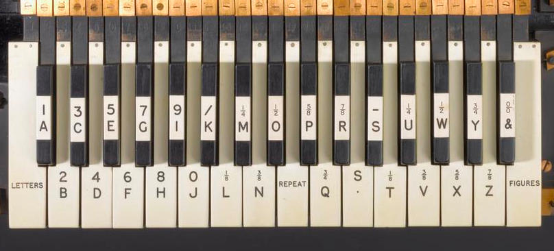
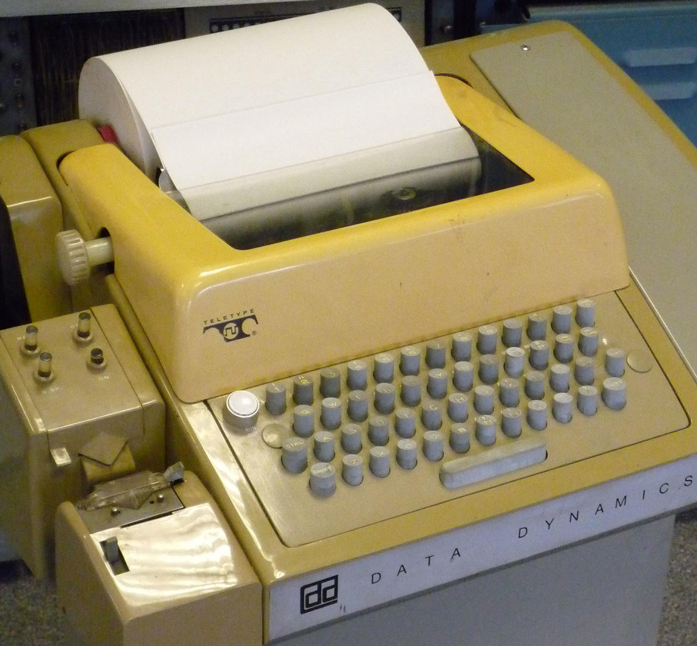
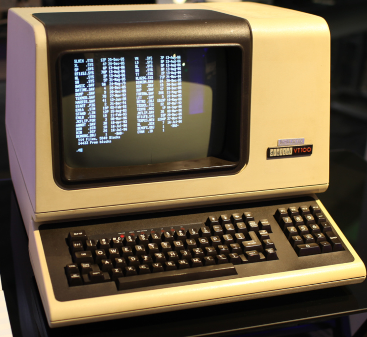

# Ancient terminals and modern days

Terminals, and modern terminal emulators that try to mimic them, suffer from issues that were understandable back in the day but not anymore. Sure, they are called "emulators" but they need not emulate features/bugs against the UX and commonsense.

Among these issues is that a *terminal cannot tell the difference between typing a key combination from typing one key after another* (for certain keys).

For example, typing `M-[` is indistinguishable from hitting `ESC` followed by `[`. Similarly, `C-I` is indistinguishable from pressing the `TAB` key, and `C-M` is the same as `RETURN`.s

For any combination that involves `Ctrl` and a printable letter, the `Shift` key may also be held redundantly, i.e. there is no difference between `C-w` and `C-S-w`.

To understand why `C-I` inserts a tab in a terminal we need to understand ASCII, and to understand ASCII we need to familiarize ourselves with the time it was developed in.

## Teleprinters

Teleprinters have evolved from the telegraph, which was a system for sending messages via cables. Telegraph was one component, the other was a printer. Connect a keyboard to a printer, then connect to a telegraph and you've got a *teleprinter*.

Most teleprinters communicated using the *ITA2* protocol, which encoded the alphabet and had few control codes and signaling characters:
- "WRU" ("Who R U") caused receiving teleprinter to send its ID
- "BEL" ringed a bell
- "CR" (carriage return)
- "LF" (line feed)

This was all in the early XX century when no electronic computers existed. All devices were mechanical and the punctured tape was used to feed the data. ITA2 and similar protocols were as efficient as Morse code; common letters like "e" and "t" were encoded by punching a single hole. A hole represented 0, no hole was 1. The encoding schema had 5 bits representing 32 values - not enough even for English. An improvement was to add two additional codes: "FIGS" and "LTRS" codes to enable switching between "figure" and "letter" modes. "FIGS R W" would produce "42". This worked, but typing FIGS or LTRS (or losing one in line noise) would result in gibberish; hardly ideal.

## Terminals

In the 1950s, teleprinters started to get connected to computers, rather than to other teleprinters. ITA2 was designed for mechanical machines and was awkward to use. ASCII was designed specifically for computer use and published in 1962.

Teleprinters used with computers were called *terminals* (as in "end of a connection", a la "train terminal"). Teleprinters were also called *TeleTYpewriters* - still used today, mostly in its shortened form as *tty*; e.g. a modern Linux OS has FS names like `/dev/tty`, `/dev/pty`, and utilities like `/bin/stty` and `/bin/tty`.

People really programmed computers using teleprinters. Here's a video of a teleprinter in action, and here's a somewhat cheesy (but interesting and cute) video which explains how they were used to program a PDP 11/10.

A terminal would connect to a computer with a serial port (RS-232), which simply transfers bytes back and forth. A terminal is more akin to a monitor with a keyboard, rather than a computer on its own. A modern monitor connected with HDMI is told "draw this pixel in this colour", in the 1960s the computer merely said "here are a bunch of characters".

If you're wondering what a "shell" is: a shell is a program to interact with your computer. It provides a commandline, runs programs, and displays the result. The terminal just displays characters. It's the difference between a TV and a DVD player.

Teleprinters needed some way to communicate events such as "stop sending me data" or "end of transmission". This is what control characters are for. The exact meaning of control characters has varied greatly over the years (which is why extensive termcap databases are required). ASCII is more than just a character set; it's a way to communicate between a terminal and a computer.

An additional method to communicate are escape sequences. This is a list of characters starting with the ESC control character (0x1b). For example F1 is <Esc>OP and the left arrow is <Esc>[OD. Computers can give instructions to terminals, too: <Esc>[2C is move the cursor 2 positions forward and <Esc>[4m underlines all subsequent text. This is also how the Alt key works: Alt+a is <Esc>a.

## Modern systems and ASCII properties

All of this matters because modern terminals operate on the same principles as those of the 1960s. If you're opening three xterm or iTerm2 windows then you're emulating three terminals connecting to a "mainframe".

If you look at the ASCII table above then there are some interesting properties: in the 1st column you can see how the left two bits are always set to zero, and that the other 5 bits count to 31 (32 characters in total; it starts at 0). The 2nd column repeats this pattern but with the 6th bit set to 1 (remember, read binary numbers from right-to-left, so that's 6th counting from the right). The 3rd column repeats this pattern again with the 7th bit set, and the final column has both bits set.

The interesting part here is that the letters A-Z and some punctuation map directly to the control characters in the 1st column. All that's needed is removing one bit, and that's exactly what the Control key did: clear the 7th bit. Lowercase and uppercase letters align in the 3rd and 4th columns, and this is what the Shift key did: clear the 6th bit.

Pressing Control+i (lowercase) would mean sending ")", which is not very useful. So most terminals interpret this as Control+I (uppercase), which sends HT. DEL is last is so all bits are set to 1. This is how you "deleted" a character in punch tapes: punch all the holes!

This is kind of neat and well designed, but for us it means:

There is no way to see if the user pressed only Control or Shift, because from a terminal's perspective all they do is modify a bit for the typed character.
There is no way to distinguish between the Tab key and Control+i. It's not just 'the same' as Tab, Control+i is Tab.
There is no way to distinguish between Control+a and Control+Shift+a.
Sending Control with a character from the 2nd column is useless. Control clears the 7th bit, but this is already 0, so Control+# will just send "#".
The world has not completely stood still and there have been improvements since the 1960s, but terminals are still fundamentally ASCII-based text interfaces, and programs running inside a terminal - like a shell or Vim - still have very limited facilities for modern key events. Non-terminal programs don't have these problems as they're not restricted to a 1960s text interface.

Note: for brevity's sake many aspects have been omitted in the above: ITA2 was derived from Murray code, the 1967 ASCII spec changed many aspects (1962 ASCII only had uppercase), there were other encodings (e.g. EBCDIC), graphical terminals such as the Tektronix 4014 (which xterm can emulate), ioctls, etc. References and further reading: An annotated history of some character codes, 7-bit character sets, Control characters in ASCII and Unicode, The TTY demystified

---

images_of_ancient_terminals_tty | note
----|-----
 | A **printing telegraph** produced in 1907. The alphabetically sorted piano keys are a great example of how the first generation of new innovations tends to resemble whatever already exists, and that it takes a few more innovations to really get the most out of it. This style of piano keyboards was introduced in the 1840s, and while the keyboard as we know it today was introduced in the 1870s, it took a while for it to replace all piano-style keyboards; this is probably among the last models that was made.
 | The **Teletype model 33 ASR**, introduced in 1963. It is one of the first ASCII teleprinters. Note the machinery on the left: you could feed this with a punched tape to automatically print a program, similar to how you would now load a program from a disk. Owing to its huge popularity, the brand name "Teletype" became synonymous with the words "terminal" and "teletype" (later, often shortened to *tty*).
 | **DEC VT100**, a kind of terminal that a terminal emulator like *xterm* tries to emulate. VT100 has a visual display and supports the essential escape sequences still in use today. These types of terminals were known as *visual terminals* - referring to the output being send to a monitor, as opposed to a printer.

## Refs

Understanding ASCII and terminals
https://bestasciitable.com/

7-bit character sets
https://www.aivosto.com/articles/charsets-7bit.html

Control characters in ASCII and Unicode
https://www.aivosto.com/articles/control-characters.html

The TTY demystified4
https://www.linusakesson.net/programming/tty/

An annotated history of some character codes, or ASCII: American Standard Code for Information Infiltration
https://web.archive.org/web/20230201034043/https://warehouse.sr-ix.com/Archive/CharCodeHist/index.html
